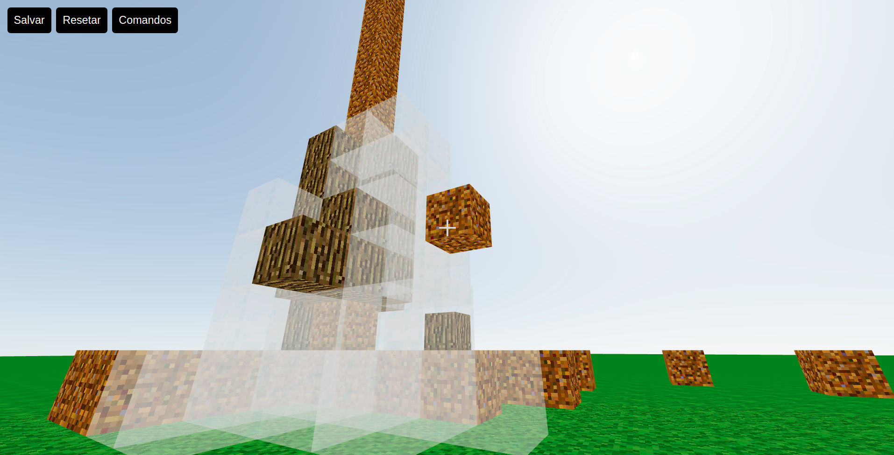

# Minecraft clone

- Minecraft clone made with react and three js;

- This project was based on a video tutorial from the <i> freeCodeCamp </i>, Link of the video bellow;

- <a href="https://www.youtube.com/watch?v=qpOZup_3P_A&t=2653s"> Code a Minecraft Clone with JavaScript, React, Three.js – Tutorial </a>

- Demo: <a href='https://minecraft-clone-three-js-vlr6-o0b7flg45-gabrielrochasouza.vercel.app/'> Link </a>

## Comands of the game

- <i> w </i> - Move Forward;
- <i> s </i> - Move Backwards;
- <i> d </i> - Move Right;
- <i> a </i> - Move Left;
- <i> 1 </i> - Select Material dirt;
- <i> 2 </i> - Select Material glass;
- <i> 3 </i> - Select Material grass;
- <i> 4 </i> - Select Material log;
- <i> 5 </i> - Select Material wood;
- <i> Space </i> - Jump;
- <i> Click </i> - Add Cube;
- <i> Alt + Click </i> - Remove Cube;

